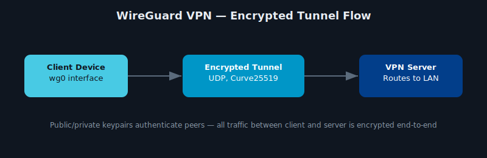

# WireGuard VPN Installation & Configuration Guide

  

This repository contains a comprehensive guide for installing and configuring **WireGuard VPN** on Ubuntu/Debian systems. WireGuard is a modern, secure, high-performance VPN designed to be simple and easy to deploy.



---

## What Is WireGuard?

[WireGuard](https://www.wireguard.com/) is a fast and modern VPN protocol that uses state-of-the-art cryptography and is built into the Linux kernel. It offers better performance, lower attack surface, and easier setup compared to traditional VPNs like OpenVPN or IPSec.

---

## Requirements

- Ubuntu 18.04+ or Debian 10+
- Root or sudo access
- Two or more devices (server/client) to connect securely

---

## Installation Steps (Ubuntu/Debian)

### 1. Update System

```bash
sudo apt update && sudo apt upgrade -y
```

### 2. Install WireGuard

```bash
sudo apt install wireguard -y
```

### 3. Enable IP Forwarding

Edit `/etc/sysctl.conf` and uncomment or add:

```bash
net.ipv4.ip_forward=1
net.ipv6.conf.all.forwarding=1
```

Then apply:

```bash
sudo sysctl -p
```

---

## Key Generation

On **both server and client**, generate private/public key pairs:

```bash
wg genkey | tee privatekey | wg pubkey > publickey
```

---

## Server Configuration

Edit `/etc/wireguard/wg0.conf`:

```ini
[Interface]
PrivateKey = <server-private-key>
Address = 10.0.0.1/24
ListenPort = 51820

[Peer]
PublicKey = <client-public-key>
AllowedIPs = 10.0.0.2/32
```

---

## Client Configuration

Edit `/etc/wireguard/wg0.conf`:

```ini
[Interface]
PrivateKey = <client-private-key>
Address = 10.0.0.2/24

[Peer]
PublicKey = <server-public-key>
Endpoint = <server-public-ip>:51820
AllowedIPs = 0.0.0.0/0
PersistentKeepalive = 25
```

---

## ▶Start WireGuard

```bash
sudo systemctl enable wg-quick@wg0
sudo systemctl start wg-quick@wg0
```

Check status:

```bash
sudo wg show
```

---

## Firewall Configuration (Optional)

Use `ufw` or `iptables` to allow UDP 51820:

```bash
sudo ufw allow 51820/udp
```

---

## Tooling: Peer Provisioning Automation

Adding a peer by hand means generating a keypair, picking an unused IP, and hand-writing two config blocks — easy to get wrong (duplicate IP, mismatched keys) as the peer list grows. `scripts/wg_peer_manager.py` automates all three steps and tracks issued peers in a registry.

```bash
pip install -r scripts/requirements.txt
python scripts/wg_peer_manager.py add laptop \
  --subnet 10.8.0.0/24 \
  --registry peers.json \
  --server-public-key <server's public key> \
  --server-endpoint vpn.example.com:51820
```

What it does:
- Generates a real Curve25519 keypair in Python (`cryptography`'s X25519 implementation) — no dependency on the `wg` binary being installed, so it runs anywhere
- Allocates the next unused IP in the subnet, automatically skipping the address reserved for the server and any already-issued peer
- Renders the exact `[Peer]` block to paste into the server's `wg0.conf`, and a ready-to-import client `.conf`
- Maintains a `peers.json` registry of issued peers (name, public key, address, issue date) — and never writes private keys to that shared file
- Rejects duplicate peer names before they collide

Run the test suite (no live WireGuard server needed — it's pure key generation and IP math):

```bash
pip install pytest
pytest tests/
```

---

## Contributing

Pull requests are welcome! Open issues or submit improvements as needed.

---

## What I Learned / Skills Demonstrated

- **Modern VPN protocol design** — why WireGuard's small codebase and Curve25519/ChaCha20 cryptography are a deliberate tradeoff against IPsec/OpenVPN's flexibility and complexity.
- **Key-based peer authentication** — public/private keypairs replacing certificate authorities or shared secrets, and what that simplifies (and what it doesn't, like revocation).
- **Network fundamentals** — routing client traffic through a tunnel interface, firewall rules for UDP, and the difference between full-tunnel and split-tunnel configs.
- **Minimal attack surface thinking** — appreciating why a VPN with one open UDP port is easier to reason about securely than a stack of legacy protocol options.

**Problem solved:** a from-scratch, secure remote-access VPN setup that avoids the configuration sprawl of older VPN protocols.

---

## Resources

- [WireGuard Official Site](https://www.wireguard.com/)
- [WireGuard Docs](https://www.wireguard.com/install/)
- [DigitalOcean WireGuard Guide](https://www.digitalocean.com/community/tutorials/how-to-set-up-wireguard-on-ubuntu-20-04)

---

## License

MIT License. See [LICENSE](./MIT%20License.txt) for more details.

---

WireGuard offers fast, secure, and simple VPN connectivity — get started today!
